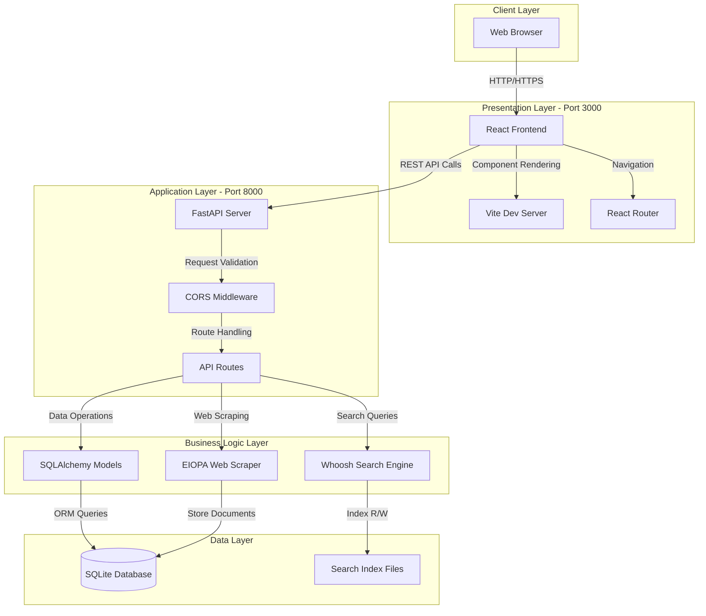
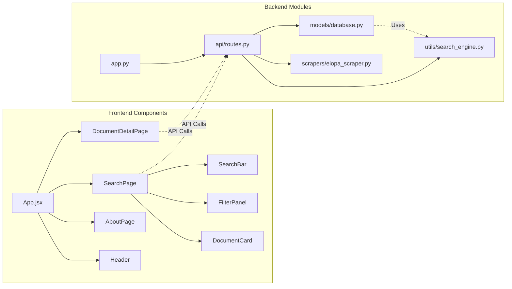
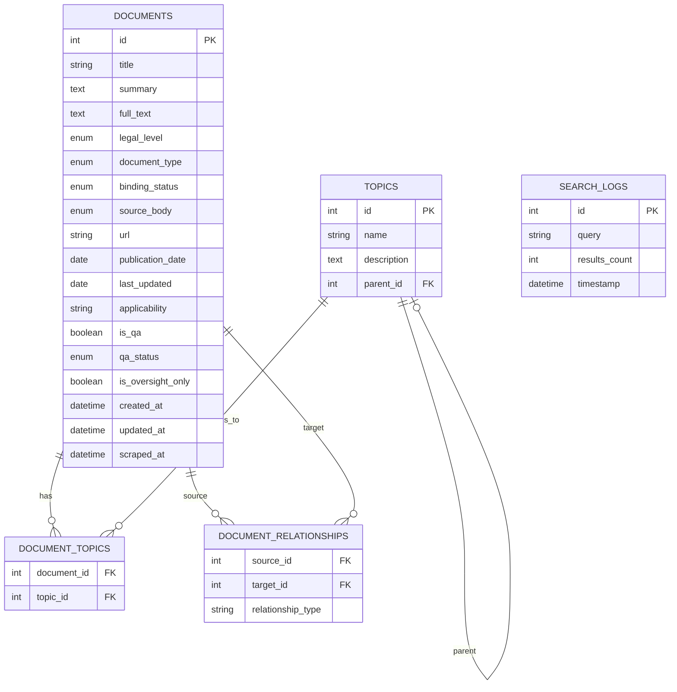
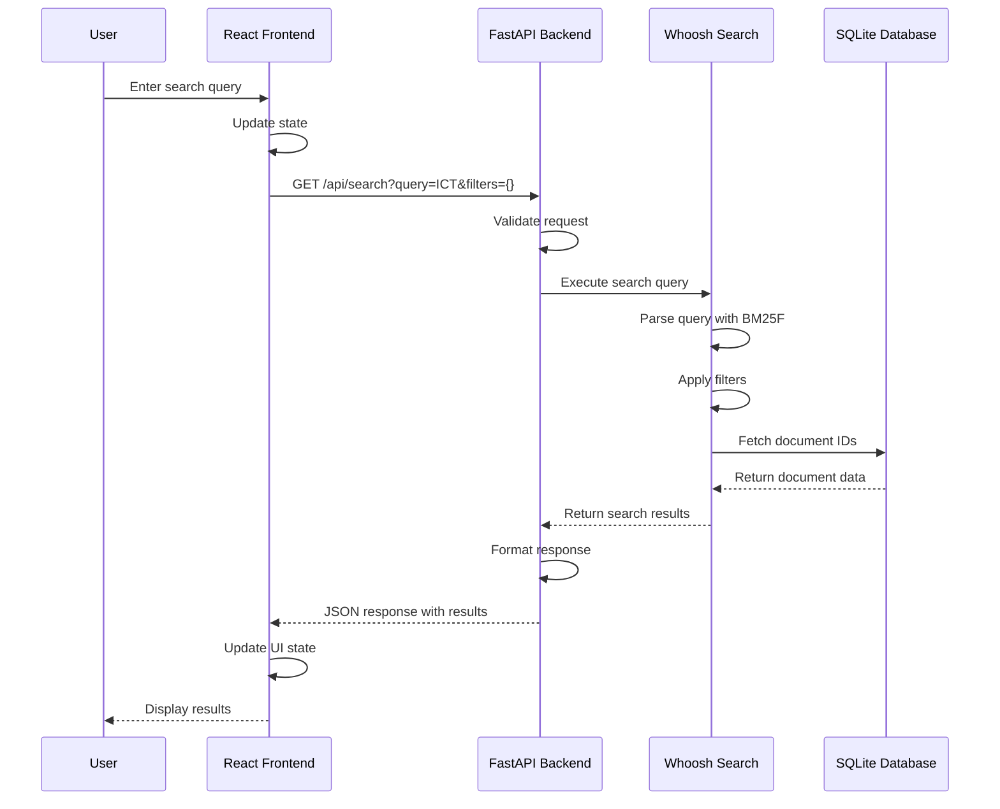
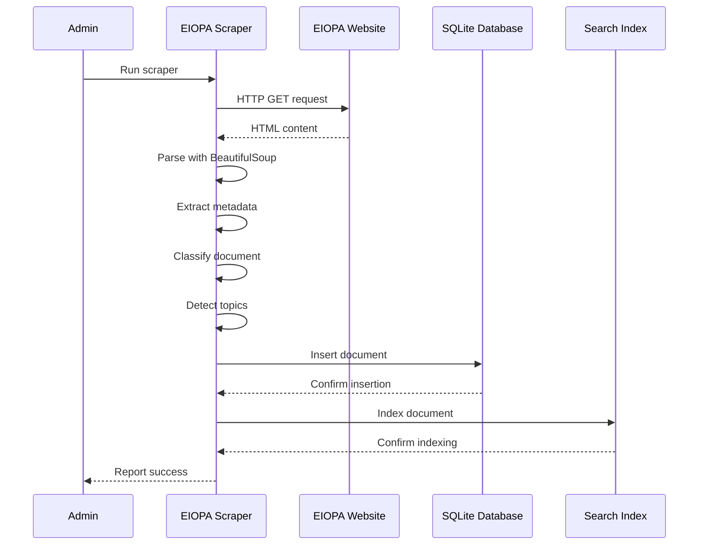

# DORA Compliance Lookup Tool - Architecture Documentation

## Table of Contents
1. [System Overview](#system-overview)
2. [Architecture Diagrams](#architecture-diagrams)
3. [Component Details](#component-details)
4. [Data Flow](#data-flow)
5. [Technology Stack](#technology-stack)
6. [Design Patterns](#design-patterns)

---

## System Overview

The DORA Compliance Lookup Tool is a full-stack web application designed to help users search, navigate, and understand EU DORA (Digital Operational Resilience Act) regulatory requirements. The system follows a modern three-tier architecture with clear separation of concerns.

### Key Characteristics
- **Architecture Pattern:** Three-tier (Presentation, Business Logic, Data)
- **Communication:** RESTful API with JSON
- **Database:** SQLite with SQLAlchemy ORM
- **Search Engine:** Whoosh full-text search
- **Frontend Framework:** React with Vite
- **Backend Framework:** FastAPI (Python)

---

## Architecture Diagrams

### 1. High-Level System Architecture



### 2. Component Architecture



### 3. Database Schema



### 4. API Endpoint Structure

```mermaid
graph TD
    API[FastAPI Root /api]
    
    API --> Search[/search]
    API --> Docs[/documents]
    API --> Topics[/topics]
    API --> Filters[/filters]
    API --> Stats[/stats]
    
    Search --> SearchQuery[GET ?query=&filters=]
    
    Docs --> DocList[GET /]
    Docs --> DocDetail[GET /{id}]
    Docs --> DocRelated[GET /{id}/related]
    
    Topics --> TopicList[GET /]
    Topics --> TopicDocs[GET /{id}/documents]
    
    Filters --> FilterOptions[GET /]
    
    Stats --> StatsData[GET /]
```

### 5. Data Flow - Search Operation



### 6. Data Flow - Document Scraping



---

## Component Details

### Frontend Layer

#### 1. React Application Structure
```
frontend/src/
├── App.jsx                 # Main application component
├── main.jsx               # Entry point
├── pages/
│   ├── SearchPage.jsx     # Main search interface
│   ├── DocumentDetailPage.jsx  # Document details
│   └── AboutPage.jsx      # About/help page
├── components/
│   ├── Header.jsx         # Navigation header
│   ├── SearchBar.jsx      # Search input
│   ├── FilterPanel.jsx    # Multi-filter UI
│   └── DocumentCard.jsx   # Document display
└── styles/
    └── index.css          # Global styles
```

#### 2. Key Frontend Features
- **React Router:** Client-side routing for SPA navigation
- **State Management:** React hooks (useState, useEffect)
- **API Integration:** Axios for HTTP requests
- **Responsive Design:** Mobile-first CSS
- **Component Reusability:** Modular component architecture

### Backend Layer

#### 1. FastAPI Application Structure
```
backend/
├── app.py                 # Main FastAPI application
├── api/
│   └── routes.py          # API endpoint definitions
├── models/
│   └── database.py        # SQLAlchemy models
├── utils/
│   └── search_engine.py   # Whoosh search integration
├── scrapers/
│   └── eiopa_scraper.py   # Web scraping logic
├── seed_sample_data.py    # Sample data seeding
└── index_documents.py     # Search indexing script
```

#### 2. Key Backend Features
- **FastAPI Framework:** High-performance async API
- **Pydantic Models:** Request/response validation
- **SQLAlchemy ORM:** Database abstraction
- **CORS Middleware:** Cross-origin support
- **Error Handling:** Global exception handlers

### Data Layer

#### 1. Database Design
- **SQLite:** Lightweight, file-based database
- **5 Tables:** Documents, Topics, Relationships, Associations, Logs
- **Relationships:** Many-to-many for topics, self-referential for documents
- **Indexes:** Optimized for search performance

#### 2. Search Engine
- **Whoosh:** Pure-Python full-text search
- **BM25F Scoring:** Relevance ranking algorithm
- **Multi-field Search:** Title, summary, full_text, topics
- **Filter Support:** Legal level, document type, binding status, etc.

---

## Data Flow

### 1. User Search Flow
1. User enters query in SearchBar component
2. React state updates trigger API call
3. FastAPI receives request at `/api/search`
4. Whoosh search engine processes query
5. Database fetches matching documents
6. Results formatted and returned as JSON
7. React updates UI with results
8. DocumentCard components render results

### 2. Document Detail Flow
1. User clicks on document card
2. React Router navigates to `/document/:id`
3. DocumentDetailPage component mounts
4. API call to `/api/documents/:id`
5. Database fetches document with relationships
6. Related documents queried
7. Full document data returned
8. Page renders with all details

### 3. Scraping Flow
1. Admin runs scraper script
2. Scraper fetches EIOPA hub page
3. BeautifulSoup parses HTML
4. Document metadata extracted
5. Classification logic applied
6. Topics detected via keywords
7. Document inserted into database
8. Search index updated
9. Process repeats for all documents

---

## Technology Stack

### Frontend
- **React 18.2.0:** UI library
- **Vite 5.0.8:** Build tool and dev server
- **React Router DOM:** Client-side routing
- **Axios:** HTTP client
- **Lucide React:** Icon library
- **CSS3:** Styling

### Backend
- **Python 3.13:** Programming language
- **FastAPI 0.115.0:** Web framework
- **SQLAlchemy 2.0.36:** ORM
- **Whoosh 2.7.4:** Search engine
- **BeautifulSoup4 4.12.3:** HTML parsing
- **Uvicorn 0.32.1:** ASGI server

### Database & Storage
- **SQLite 3:** Relational database
- **File System:** Search index storage

### Development Tools
- **Git:** Version control
- **GitHub CLI:** Repository management
- **npm:** Package management (frontend)
- **pip:** Package management (backend)

---

## Design Patterns

### 1. MVC Pattern (Modified)
- **Model:** SQLAlchemy models (database.py)
- **View:** React components
- **Controller:** FastAPI routes (routes.py)

### 2. Repository Pattern
- Database access abstracted through SQLAlchemy
- Search operations encapsulated in DORASearchEngine class

### 3. Factory Pattern
- Document creation and classification in scraper
- Search query building in search engine

### 4. Singleton Pattern
- Database session management
- Search engine instance

### 5. Observer Pattern
- React state management with hooks
- Component re-rendering on state changes

### 6. Strategy Pattern
- Different search strategies (exact, fuzzy, filtered)
- Document classification strategies

---

## Security Considerations

### 1. API Security
- CORS configuration for allowed origins
- Input validation with Pydantic
- SQL injection prevention via ORM
- XSS prevention in React

### 2. Data Security
- No sensitive user data stored
- Public regulatory information only
- Read-only operations for end users

### 3. Compliance
- Clear disclaimers (not legal advice)
- Source attribution for all documents
- Transparent data sourcing

---

## Performance Optimization

### 1. Frontend
- Component lazy loading
- Efficient re-rendering with React keys
- Debounced search input
- Pagination for large result sets

### 2. Backend
- Database query optimization
- Search index caching
- Async request handling
- Connection pooling

### 3. Database
- Indexed columns for fast lookups
- Normalized schema to reduce redundancy
- Efficient relationship queries

---

## Scalability Considerations

### Current Architecture (Development)
- Single-server deployment
- SQLite database
- File-based search index
- Suitable for: < 10,000 documents, < 100 concurrent users

### Future Scaling Options
1. **Database:** Migrate to PostgreSQL for production
2. **Search:** Consider Elasticsearch for large datasets
3. **Caching:** Add Redis for API response caching
4. **Load Balancing:** Multiple backend instances
5. **CDN:** Static asset delivery
6. **Containerization:** Docker for consistent deployment

---

## Deployment Architecture

### Development Environment
```
Local Machine
├── Backend: localhost:8000
├── Frontend: localhost:3000
├── Database: ./backend/dora.db
└── Search Index: ./backend/search_index/
```

### Production Environment (Recommended)
```
Cloud Infrastructure
├── Frontend: Vercel/Netlify (Static hosting)
├── Backend: AWS EC2/Heroku (API server)
├── Database: AWS RDS/PostgreSQL
├── Search: Elasticsearch/AWS OpenSearch
└── CDN: CloudFront/Cloudflare
```

---

## Monitoring & Logging

### Current Implementation
- Search query logging in database
- Console logging for development
- Error tracking in FastAPI

### Recommended Additions
- Application Performance Monitoring (APM)
- Error tracking (Sentry)
- Analytics (Google Analytics)
- Uptime monitoring
- Database performance metrics

---

## Conclusion

The DORA Compliance Lookup Tool follows modern web application architecture principles with clear separation of concerns, scalable design patterns, and efficient data flow. The system is designed to be maintainable, extensible, and performant while providing a user-friendly interface for regulatory research.